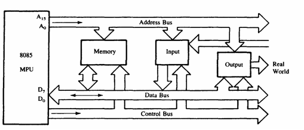
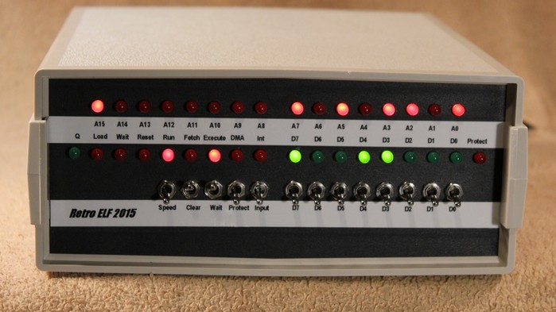
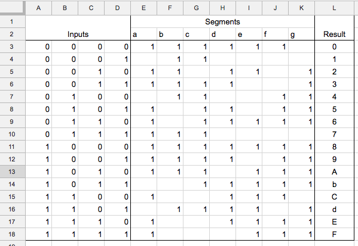
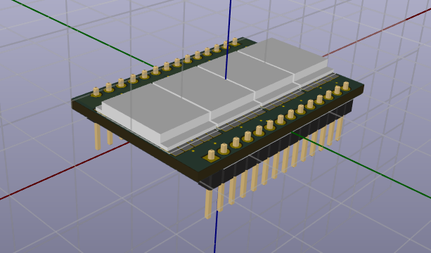
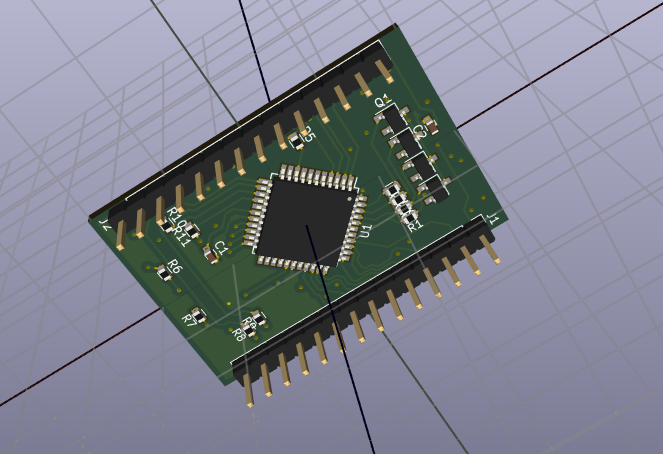
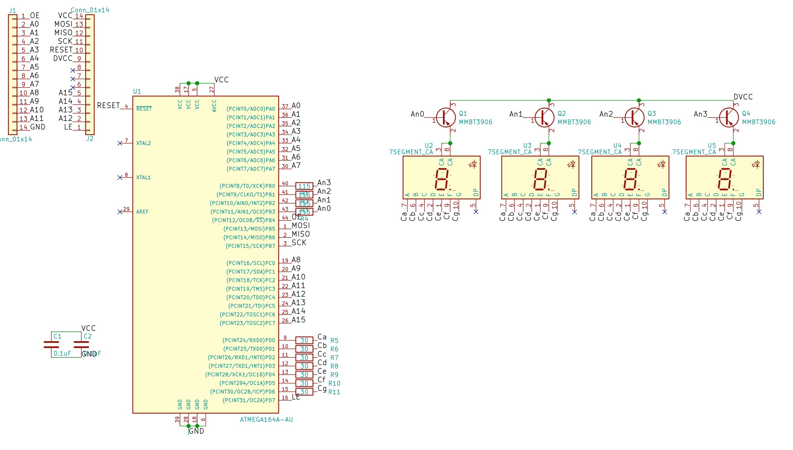
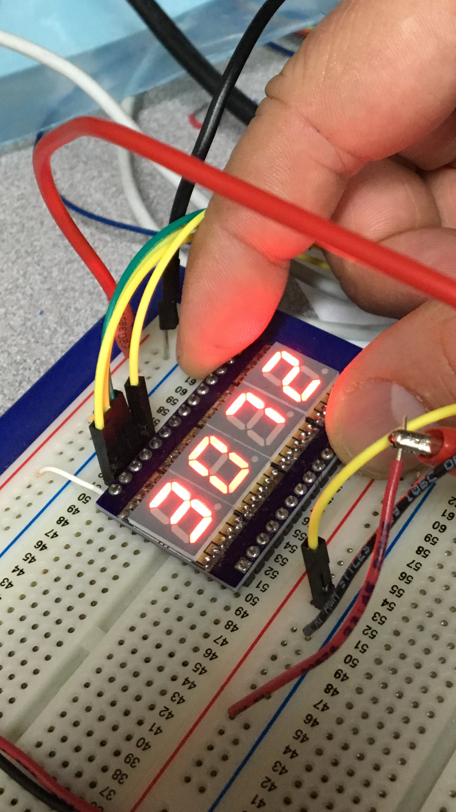

A 4 digit (16 bit) binary to 7-segment display.

Wanting to have some convenient module for displaying address bus contents.

# What is this and why would I want this?
If you were playing with an old retro computer type of architecture, on a breadboard, and you wanted to view the contents of like the address bus, or a data bus as a hexadecimal value.

In a simpler time when building microcontrollers using discrete CPU to simple static RAM and EEPROM devices. Back when the interconnects between teh CPU, ROM, RAM, and peripherals were the separate parallel busses, like simple 16 bit address bus, 8 bit data bus, the control bus, etc.

Now a days one would just spend $20 and get an Arduino, or $30 and get a Raspberry pi. and then connect it by USB to your laptop. And make use of the variety of widely avaialable community software. The hard work of design has been done for you.

But when working with these old parallel binary bus types of architectures, it is useful to be able to see what is going on when you are developing the hardware and the bare-metal software.

Usually you would be a monitor and debug panel with LED and switches on it. And then you have to look at the LEDs and interpret the value of these.

Photo from [astrorat.com](http://www.astrorat.com/cosmacelf/retroelf2015.html)

But if you are used to thinking in base 16 instead of binary, then having a hexadecimal display is much better. Trying to fight the process and interpret the binary LEDS is very slow, tedious, and error prone.

Only usually if you have to want a binary-to-hex display, then you have wire up your own decoder, because there does not readily exist a binary-to-hex decoder IC.

Ok, so we can think about this and design a truth table for what pins to the LED display we want to have activated depending on what binary input there is.

You want to make four of these for your 16 bit address bus and another two for your 8 bit data bus. The discrete logic components required to do this take up as much if not more breadboard space as the rest of your microcontroller circuits. And the displays are horribly spaced randomly about your breadboard and you can hardly read them now too.

I guess sometimes it is possible where you might have access to a [GAL device](https://en.wikipedia.org/wiki/Generic_array_logic), but not as likely that you would have, or can afford, the programmer for these, because you are just an enthustiac hobbyist and trying to learn something new here and only have a pile of ~~rubbish~~ retro computer parts and a breadboard to play with. That would be awesome and elegant to craft a single inexpensive DIP device as your binary to Hex digit decoder though...

But then it is still tedious and error prone to have to wire up your testing tools when you are trying to use them to test things. Because every time you wire it up you have to go through the process of testing your testing tool.

What if you just had a convenient module you could just plug into a breadboard and have it readily display the decoded bus contents. That is what this does.

Inspired by https://www.youtube.com/watch?v=o9eQ9NhFT60

# V1 Hardware
This is a 28 DIP form factor circuit board using an Atmega 164A. Because it has a lot of IO pins.

Using Atmega164A device and 4 10mm 7 segment displays.

<table>
<tr><td>
</td><td></td></tr></table>

The device was chosen because it has enough IO pins to directly drive all the segments with display multiplexing (the common anodes, using a transistor driver).

It was supposed to be a 28 pin dip format, but it is accidentally almost too wide to fit on a breadboard. Well, almost too wide. some cretive wiring under the display module on the breadboard should work.

Since we have pins for the MISO, MOSI, SCK. We can have a mode where this thing is an I2C or SPI slave and displays values on an I2C bus? That might be an intersting use. A display module. Though I would probably just use it as a clock since thats all I seem to build these days.

The schematic is set up to have the 16 address pins, an output enable pin and a latch enable pin.

So the idea is to read the input pin values. and then display value as hex, using software to multiplex the displays.

And then here it is built and getting tested.

I made a small program to just loop and count up digits to test it, so I don't have to wire up input switches.

# Programming
At first I had some learning curve to program this. I was using the Arduino IDE (instead of spending time to get avr-gcc and the tool chain to work on its own with a Makefile, becuase.. macbook here..).

The AT164A is not directly supported hardware, but there is this project for [MightyCore](https://github.com/MCUdude/MightyCore) that seems to bring the AT164 support among others to the Arduino IDE.

I tried to use the "Arduino as ISP" sketch to create an ICSP and attached it to the pings on my module. Though it would not be recognized still.  I verified the Arduino as ISP setup worked by programming an Attiny85. That led to a tangent project to learn how to build a HVSP programmer on a second arduino to rese the fuzes, because I bricked the Attiny85 by accident. And then the desire to create an all in one programmer that can handle both cases. But that fell apart when I discovered there is already a usbtiny programmer project and not wanting to lose focus on the bigger picture which was to get this damn device I built in like February (it is now late April) to program so I can just see if it even works. You know. prototyping by designing and fabricating a PCB from the get go because stupid surface mount everything, what can possibly go wrong. Oh right, everything.

So then putting some energy into to build the usbtinyisp, as maybe that would work for me instead of the Arduino as ISP thing, but feeling no budget lately, and then remembering I had a bunch of Digispark devices that have the same-ish kind of hardware that the usbtiny programmer has. So then the idea to use this as a usbtiny isp. And a few iterations with the arduino as isp and HVSP programmers to realize the USB cable I was using for it was really a 2 wire power cable and not even a USB cable at all. How many sleepless nights are we up to now anyway. At least we now have a fork on Github for the vusbtiny project, with digispark hardware.

So getting the usbtiny programmer to work, and then learning we need to edit the avrdude.conf file to allow it to recognize the Atmega164A device. And then learning the Arduino IDE supports a `Upload using programmer` mode, so then going back to just using that. And here we are. Other than some random crazy ramblings and a somewhat arbitrary path to get here, I have uninteligently managed to use Arduino IDE with MightyCore, the updated avrdude.conf, with a usbtinyisp.

# TODO
Some ideas so far for improment:

* Lay out the board to be not as tall. It barely fits on a breadboard now. Maybe need to use slightly smaller displays. The priority at the time was to have the edges flat and narrow so two or modules could be placed side by side for a 32 bit readout. But then we forgot we can't be too tall either.

* Create a socket adapter module to fit a standard 27xx series (E)EPROM type of DIP socket, with the pin outs of these memory devices. So we can have the hex display show the contents of the address bus. The use case here is we could place this display into a socket on a motherboard of an existing retro computer, or piggy back it onto the (E)EPROM so we can see what is going on when the computer is operating.

* Improve the firmware. Investigate using C and avr-gcc directly. Learning more about the registers and internal details of the microcontroller. For now the delays in the visual display of numbers were thought to be "good enough". Using the internal uncalibrated oscillator of the device, so nothing timing critical going on here too.

* Investigate adding serial input option, i2c slave feature (using the USIwire, because the SDA/SCL pins for hardware TWI are also PC0..PC1, which is A8 and A9 inputs) or SPI. We have the SPI pins on PB5..PB7 for programming, but not used in normal operation.
